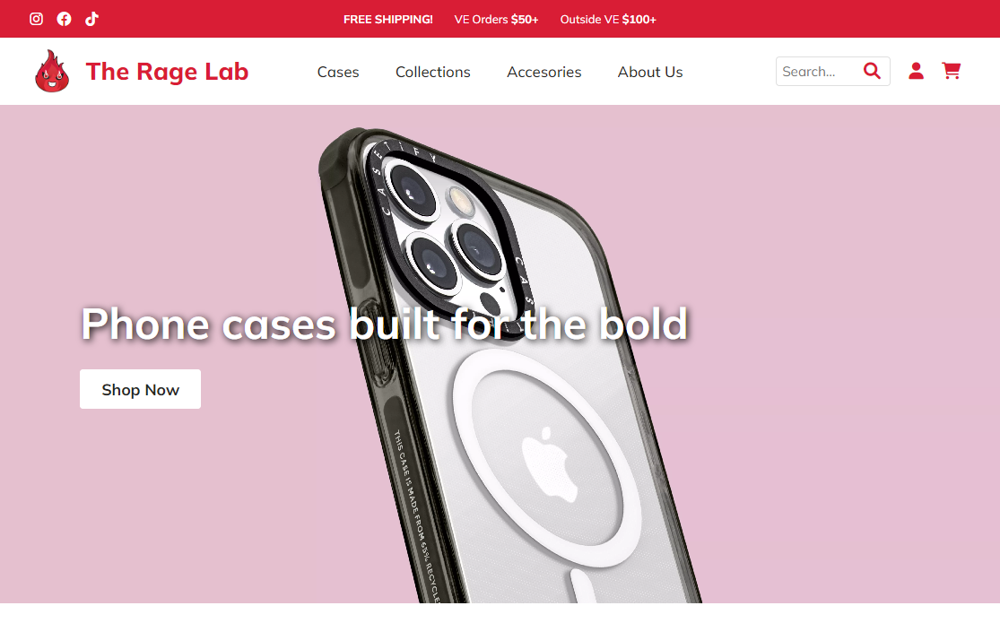
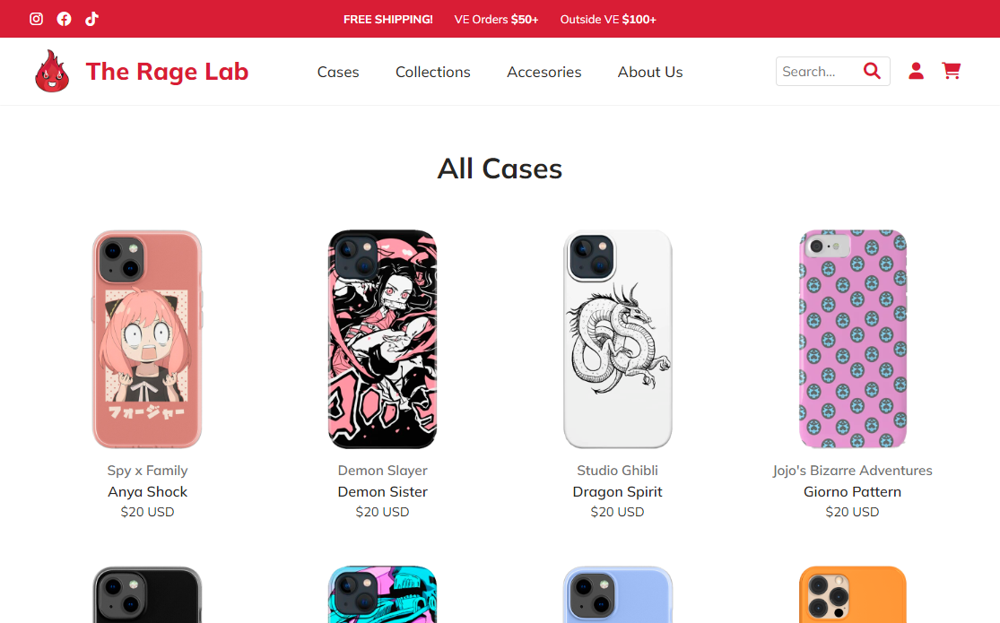
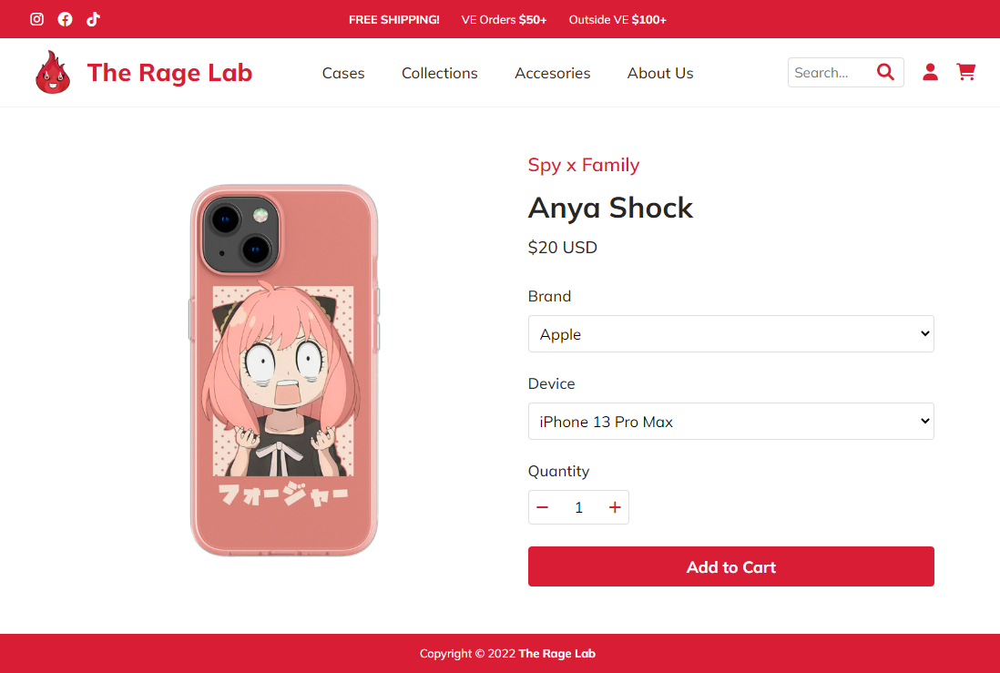

<div align="center">
  
  <h1>The Rage Lab: E-commerce Website</h1>

  <p>
    E-commerce website focused on pop culture themed phone cases
  </p>

  <p>
    <a href="https://github.com/danxschz/store-app/graphs/contributors">
      
    </a>
    <a href="https://github.com/danxschz/store-app/commits/main">
      
    </a>
    <a href="https://github.com/danxschz/store-app/blob/master/LICENSE">
      
    </a>
  </p>

  <h4>
    <a href="https://danxschz.github.io/store-app">View Demo</a>
    <span> · </span>
    <a href="https://github.com/danxschz/store-app/issues/">Report Bug</a>
  </h4>
</div>

<br>

## About the Project

### Screenshots

<div align="center">
  <h3>Desktop</h3>
  
  
  &nbsp;
  
  

  &nbsp;

  
</div>

### Built With

- React
- React Router
- JavaScript
- HTML
- CSS Modules
- Sass
- npm
- webpack

### Color Reference

| Color         | Hex     |
| :--------:    | :-----: |
| Background    | #FFFFFF |
| Primary       | #D91D35 |
| Text          | #272624 |
| Neutral Gray  | #707070 |

## Getting Started

### Run Locally

In order to setup and work on this project on your own, you will need to:

Clone the project

```bash
  git clone https://github.com/danxschz/store-app.git
```

Go to the project directory

```bash
  cd store-app
```

Install dependencies

```bash
  npm install
```

## Usage

- Browse through the store pages thanks to a client-side routing implementation
- Features a fully functional cart system and item sorting by collection.

## License

Distributed under the MIT License. See LICENSE for more information.

## Contact

Daniel Sanchez (@danxschz) - danxschz@gmail.com
